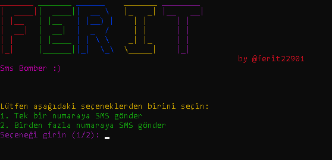

# 📱 Sms Bomber

Bu program ile SMS mesajlarını hızlı bir şekilde belirlediğiniz numaralara gönderebilirsiniz. Birden fazla numaraya aynı anda veya tek bir numaraya SMS gönderme seçeneğiniz bulunuyor.

## ⚠️ Güvenlik Uyarısı

Bu programın kötü niyetli kullanımı yasaktır ve yasa dışı olabilir. Bu programı yasal ve etik sınırlar içinde kullanın. Programın kullanımından doğacak sorumluluklar size aittir.

## 📸 Ekran Görüntüsü



## 🔧 Kurulum

Aşağıdaki komutları kullanarak programı kurabilirsiniz:

```bash
git clone https://github.com/Memati8383/sms.git
cd sms
pip install -r requirements.txt
python main.py
```

## 📋 Kullanım Talimatları

1. Program başladığında aşağıdaki seçeneklerden birini seçin:
   - Tek bir numaraya SMS gönder
   - Birden fazla numaraya SMS gönder

2. "Tek bir numaraya SMS gönder" seçeneğini seçerseniz:
   - Hedef telefon numarasını girin
   - Gönderme sayısını belirtin

3. "Birden fazla numaraya SMS gönder" seçeneğini seçerseniz:
   - Birden fazla isimlerini ve numarayı ekleyin
   - Eğer daha fazla eklemek istemiyorsanız `q` basın
   - Gönderme sayısını belirtin

## 📚 Bilgi

Daha fazla bilgi ve güncellemeler için [GitHub sayfamı](https://github.com/Memati8383) ziyaret edebilirsiniz.

## 📬 İletişim

Eğer herhangi bir sorunuz, geri bildiriminiz veya işbirliği teklifiniz varsa, aşağıdaki iletişim bilgileri üzerinden bana ulaşabilirsiniz:

- **E-posta**: [Mail Adresim](mailto:akdemirferit608@gmail.com)
- **GitHub**: [GitHub Profilim](https://github.com/Memati8383)
- **LinkedIn**: [Instagram Profilim](https://www.instagram.com/ferit22901)
- **Discord Sunucu**: [Discord Sunucum](https://discord.gg/HAD7YTgu)
- **Discord**: ***esatoktay_yldrn***

Ayrıca GitHub üzerinden sorunlar oluşturarak veya pull istekleri göndererek de iletişim kurabilirsiniz.

<!-- <br><br> -->
